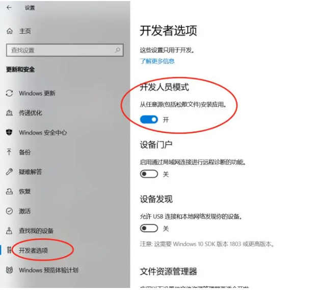
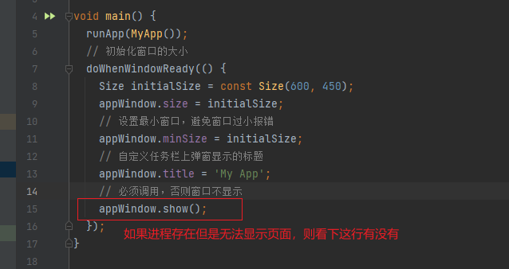

1. 前置依赖，[官方文档](https://pub.dev/packages/bitsdojo_window)
    ```yml
    dependencies:
      flutter:
        sdk: flutter
      # 窗口增强
      bitsdojo_window: ^0.1.5
    ```
2. 文件修改
    - windows\runner\main.cpp文件（针对windows应用）
      ```cpp
      # 文件最上方
      #include <bitsdojo_window_windows/bitsdojo_window_plugin.h>
      auto bdw = bitsdojo_window_configure(BDW_CUSTOM_FRAME | BDW_HIDE_ON_STARTUP);
      ```
    - macos\runner\MainFlutterWindow.swift（针对macos应用）
      ```swft
      import FlutterMacOS
      import bitsdojo_window_macos // Add this line   
      class MainFlutterWindow: NSWindow { # 修改成如下
      class MainFlutterWindow: BitsdojoWindow {

      override func bitsdojo_window_configure() -> UInt {
      return BDW_CUSTOM_FRAME | BDW_HIDE_ON_STARTUP
      }
      ```
    - linux\my_application.cc（针对Linux应用）
      ```cc
      # 最上面添加下面一行
      #include <bitsdojo_window_linux/bitsdojo_window_plugin.h>
      gtk_window_set_default_size(window, 1280, 720);
      gtk_widget_show(GTK_WIDGET(window));
      # 以上两行修改成如下
      auto bdw = bitsdojo_window_from(window);            // <--- add this line
      bdw->setCustomFrame(true);                          // <-- add this line
      //gtk_window_set_default_size(window, 1280, 720);   // <-- comment this line
      gtk_widget_show(GTK_WIDGET(window));    
      ```
3. 开发过程中可能出现的错误
   ```shell
   Please enable Developer Mode in your system settings. Run
   start ms-settings:developers
   to open settings.
   ```
   
   